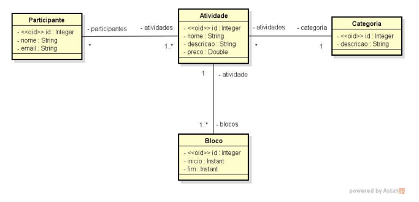
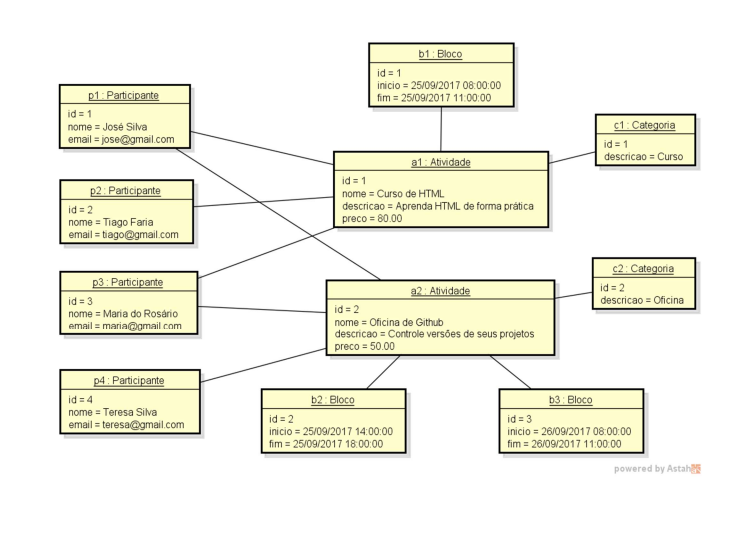

## DESAFIO 
Criar um projeto no Spring Boot com Java e banco de dados H2, e implementar o modelo conceitual conforme especificações a seguir. Além disso, você deve fazer o seeding da base de dados conforme diagrama que segue.

## ESPECIFICAÇÃO - SISTEMA PARTY CLUB

Deseja-se construir um sistema para gerenciar as informações dos participantes das atividades de um evento acadêmico. As atividades deste evento podem ser, por exemplo, palestras, cursos, oficinas práticas, etc. Cada atividade que ocorre possui nome, descrição, preço, e pode ser dividida em vários blocos de horários. Para cada participante, deseja-se cadastrar seu nome e email.

## MODELO CONCEITUAL 

## SEENDING DE DADOS

### Este é um desafio proposto pelo professor Nélio Alves da plataforma DevSuperior(https://devsuperior.com.br/)